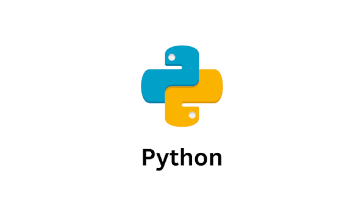

# coding-test

**프로그래머스 코딩테스트 입문 · 기초 트레이닝 풀이 노트**

풀이 + 오답노트 (Velog용 md)

 

---

## 목차

- [Lv.0 · 코딩테스트 입문](#lv0--코딩테스트-입문)
- [Lv.2](#lv2)
- [기타 · PCCE / 연습](#기타--pcce--연습)

---

## Lv.0 · 코딩테스트 입문

| # | 문제 | 언어 | 노트 |
|---|------|------|------|
| 1 | 두 수의 나눗셈 | Java | [보기](./lv0/두-수의-나눗셈.md) |
| 2 | 두 수의 차 | Java | [보기](./lv0/두-수의-차.md) |
| 3 | 문자 출력 | Java | [보기](./lv0/문자-출력.md) |
| 4 | 각도 합치기 | Java | [보기](./lv0/각도-합치기.md) |
| 5 | 분수의 덧셈 | Java | [보기](./lv0/분수의-덧셈.md) |
| 6 | 배열 두배 만들기 | Java | [보기](./lv0/배열-두배-만들기.md) |
| 7 | 중앙값 구하기 | Java | [보기](./lv0/중앙값-구하기.md) |
| 8 | 최빈값 구하기 | Java | [보기](./lv0/최빈값-구하기.md) |
| 9 | 짝수는 싫어요 | Java | [보기](./lv0/짝수는-싫어요.md) |
| 10 | 피자 나눠 먹기 (1) | Java | [보기](./lv0/피자-나눠-먹기-1.md) |
| 11 | 피자 나눠 먹기 (2) | Java | [보기](./lv0/피자-나눠-먹기-2.md) |
| 12 | 배열의 평균값 | Java | [보기](./lv0/배열의-평균값.md) |
| 13 | 옷가게 할인 받기 | Java | [보기](./lv0/옷가게-할인-받기.md) |
| 14 | 문자 리스트를 문자열로 변환하기 | Python | [보기](./lv0/문자-리스트를-문자열로-변환하기.md) |
| 15 | 대소문자 바꿔서 출력하기 | Python | [보기](./lv0/대소문자-바꿔서-출력하기.md) |
| 16 | 홀짝 구분하기 | Python | [보기](./lv0/홀짝-구분하기.md) |
| 17 | 연속된 수의 합 | Python | [보기](./lv0/연속된-수의-합.md) |
| 18 | OX퀴즈 | Python | [보기](./lv0/OX퀴즈.md) |
| 19 | 다음에 올 숫자 | Python | [보기](./lv0/다음에-올-숫자.md) |
| 20 | 옹알이 (1) | Java | [보기](./lv0/옹알이-1.md) |
| 21 | 정수를 나선형으로 배치하기 | Python | [보기](./lv0/정수를-나선형으로-배치하기.md) |
| 22 | 겹치는 선분의 길이 | Python | [보기](./lv0/겹치는-선분의-길이.md) |
| 23 | 평행 | Python | [보기](./lv0/평행.md) |
| 24 | 안전지대 | Python | [보기](./lv0/안전지대.md) |
| 25 | 다항식 더하기 | Python | [보기](./lv0/다항식-더하기.md) |
| 26 | 코드 처리하기 | Python | [보기](./lv0/코드-처리하기.md) |
| 27 | 배열 조각하기 | Python | [보기](./lv0/배열-조각하기.md) |

---

## Lv.2

| # | 문제 | 언어 | 노트 |
|---|------|------|------|
| 1 | 최고의 집합 | Java | [보기](./lv2/최고의-집합.md) |
| 2 | 점 찍기 | Java | [보기](./lv2/점-찍기.md) |

---

## 기타 · PCCE / 연습

| # | 문제 | 노트 |
|---|------|------|
| 1 | 수 나누기 (PCCE) | [보기](./etc/수-나누기.md) |
| 2 | 병과 분류 | [보기](./etc/병과분류.md) |
| 3 | 심폐소생술 | [보기](./etc/심폐소생술.md) |

---

### 노트 구성

각 md 파일은 아래 형식으로 정리

`## 풀이` → `## 오답노트` → `## 정답`

 

